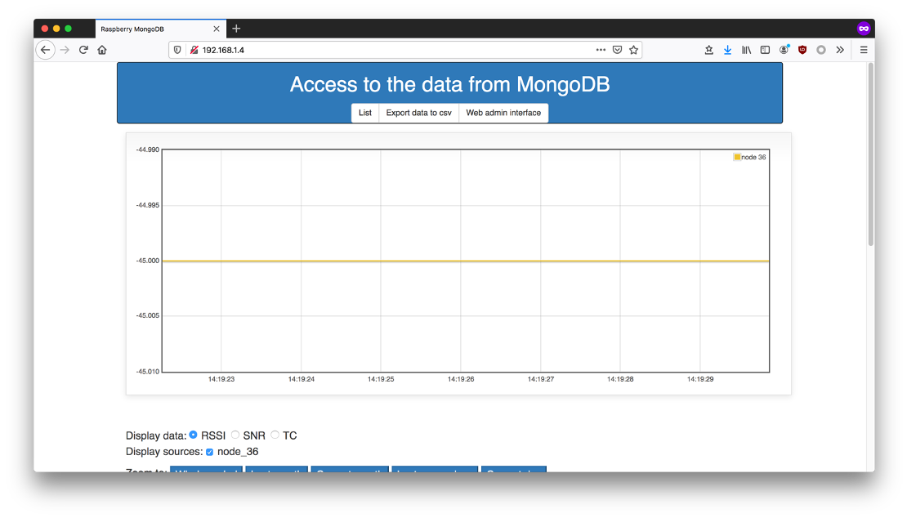
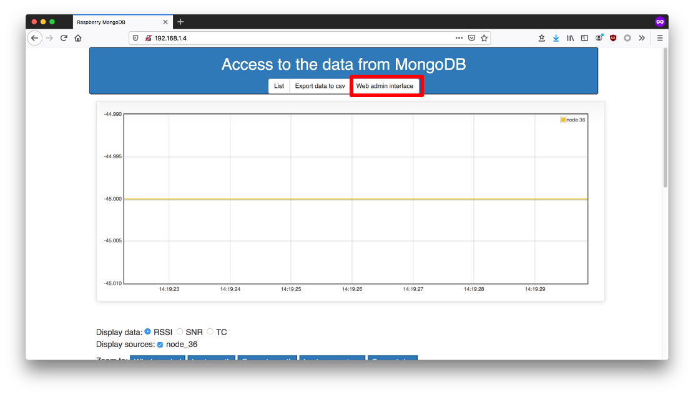
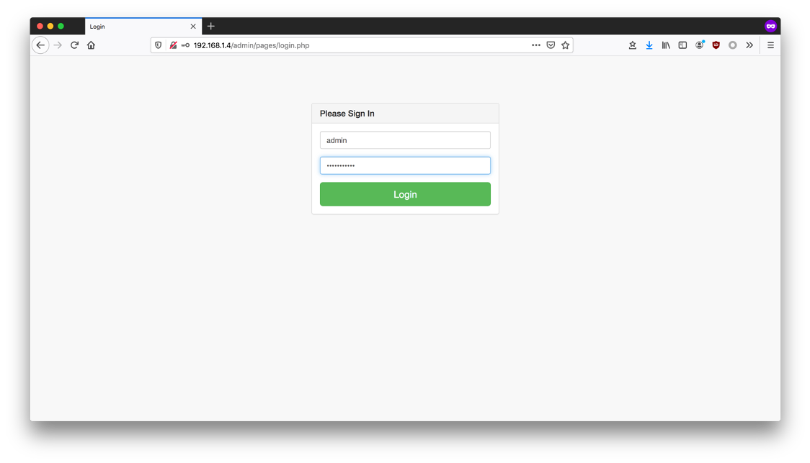
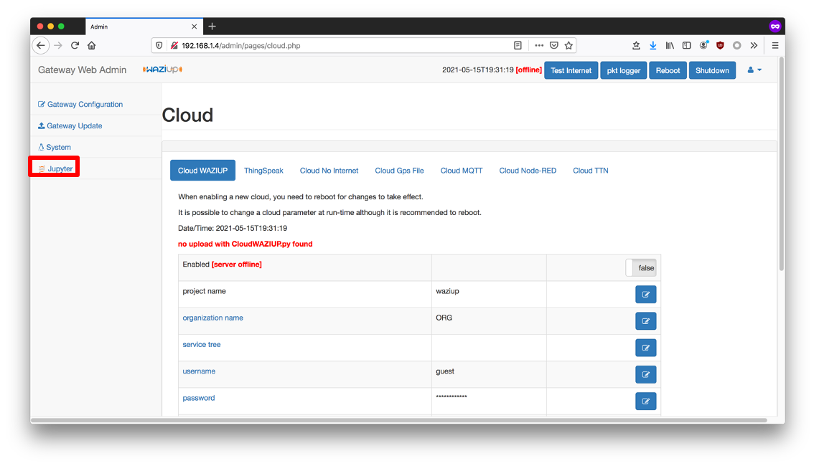
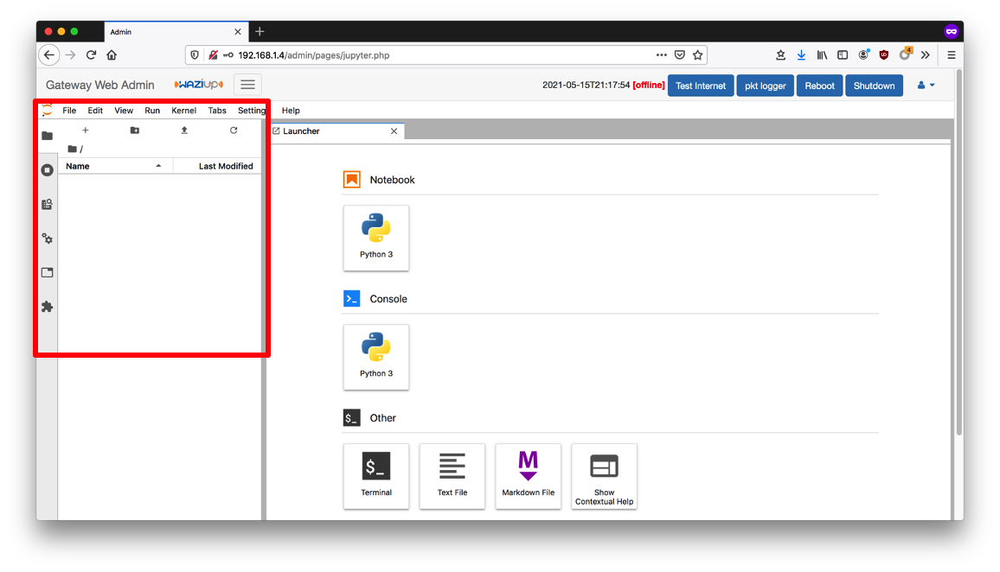

# LoRa Gateway AI Framework

This framework is an interface or tool that allows users to build and use Artificial Intelligence
models easily on LoRa Gateway, without getting into the depth of the underlying algorithms and runtime environment setup. It's based on Jupyter-Lab Docker container.

## How to Access LoRa Gateway AI Framework

### 1. Load the LoRa Gateway web interface
   `http://<LoRa Gateway IP address>`  

### 2. Click on Web Admin Interface

### 3. Enter Admin Credentials
   Default credentials: **admin / loragateway**  

### 4. Web Admin Landing Page
   Click on Jupyter Link on the left aside bar  

### 5. Jupyter Landing Page
   Create or open a Notebook of your preference. Traverse directories using the left panel navigator.

   **Notebooks are saved in "/home/pi/lora_gateway/AI/notebooks" directory. To import Notebooks, they must be placed in this directory to show up on Jupyter.**
